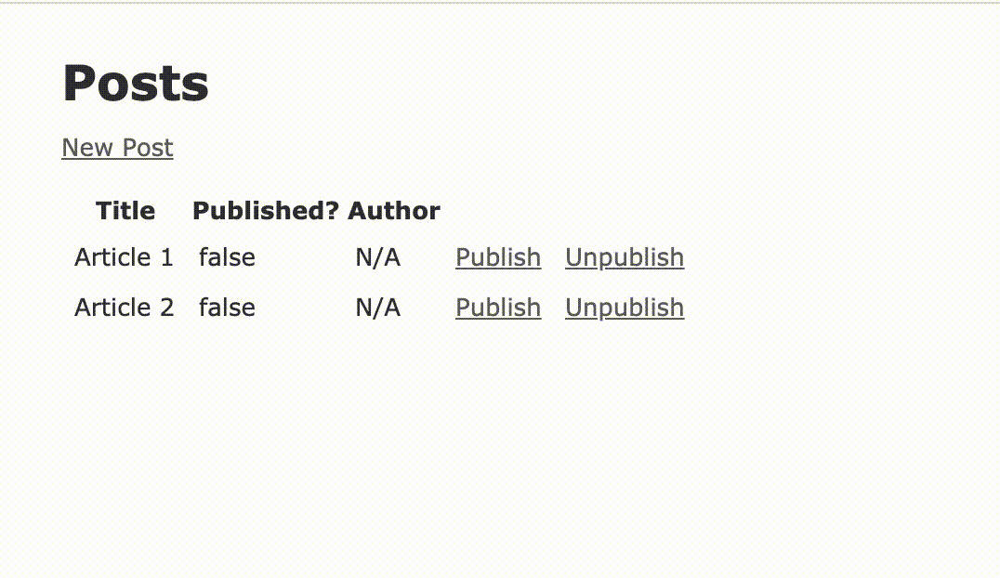

---

title: Alternative To Service Object In Rails
date: 2020-12-05 10:00 UTC
description: Lorem ipsum dolor sit amet, consectetur adipisicing elit, sed do eiusmod tempor incididunt ut labore et dolore magna aliqua. Ut enim ad minim veniam,
tags: Rails, ActiveModel, Service Object
<!-- social_media: social-media-2.png -->

---

{::options parse_block_html="true" /}

# Rails - Alternative to Service Objects

Service Objects... Some think it is a best practice, others an anti-pattern that we should stop using now. More comments start to pop up and challenge this pattern:

* [Reddit: Where did concept of service object come from?](https://www.reddit.com/r/rails/comments/itivdn/where_did_concept_of_service_object_come_from/)
* [Jason Swett: Beware of “service objects” in Rails](https://www.codewithjason.com/rails-service-objects/)

Service objects mean different things for different people. Here is what I consider a service object.

* A class which interface has **one** public `#perform` or `#call` method.
* A class which name describes an action (verb + adjective + noun).
* Example: `CreatePublishedPost.perform(post: @post)`

**Service objects are overused, here, I said it**. This pattern becomes the default for any feature in Rails but this article won't discuss the pros and cons of service objects. This article is an attempt to describe a different implementation where a service object would generally be used. The intent is to enlarge our options as Rails devs and show another take.

The solution in this post uses **ActiveModel** on a non ActiveRecord class, this is pretty old stuff and has been documented many times.

## The feature - Publish / Unpublish a Post

The feature we're going to implement here is a simple publish/unpublish action on a Post.

 Nothing fancy a Post has a body and a title and can belong to a Publisher. Here are the model definitions:

~~~ruby
  # config/routes.rb
  root 'posts#index'
  resources :posts

  # Models
  class Post < ApplicationRecord
    belongs_to :publisher, optional: true

    delegate :name, to: :publisher, prefix: true, allow_nil: true
  end

  class Publisher < ApplicationRecord
  end

  # db/schema.rb
  # create_table "posts", force: :cascade do |t|
  #   t.string "title"
  #   t.text "body"
  #   t.integer "publisher_id"
  #   t.boolean "published"
  # end

  # create_table "publishers", force: :cascade do |t|
  #   t.string "name"
  # end
~~~
{: data-target="code-highlighter.ruby"}

### The Service Object Way

Let's start by describing quickly how we would tackle this with service objects. Roughly we would add `#new_publication`, `#publish` and `#unpublish` routes to the post resources and define them on posts_controller.rb. Then create two new services. **PublishPost** & **UnpublishPost**

~~~ruby
  # routes
  resources :posts do
    get :new_publication, on: :member
    put :publish, on: :member
    put :unpublish, on: :member
  end

  # app/controllers/posts_controller.rb

  def new_publication
  end

  def publish
    if PublishPost.perform(params)
      redirect
    else
      render :new_publication
    end
  end

  def unpublish
    UnpublishPost.perform(params)
    redirect
  end
~~~
{: data-target="code-highlighter.ruby"}

#### The dangers

##### Form Errors

First thing that comes to mind is the error handling and how to display those on the views. You'll most likely have to tweak your `_form` partial to display errors appropriately because it doesn't fit quite the Rails way with ActiveRecord:

* You might create a view or a form object to handle this part correctly.
* You might proxy errors to the post model and reference `@post` in your `new_publication` view.
* You might have an errors array that you loop through in your view.

With time, devs using service objects will probably end up with a solution to solve this that they'll apply across all their routes. From my experience this is rarely the case and multiple implementations of error handling or form views are spread across the codebase. Devs then spend time going against the Rails way to fulfill the use of service objects.

##### Controller routes

I admit, this one is not inherently a service object's flaw. You could use service objects with dedicated RESTful routes. I generally see this implementation paired with service objects for some reason. The `posts_controller` now has three more actions and is likely to grow when you'll want to archive, review or approve a post. This is likely to make the controller really difficult to maintain in the future.

**Idea for improvement:** Routes are not for ActiveRecord classes only.

##### Reusability

The trap of services is to think that they are DRY and reusable. What I generally witness is the idea that a service is so good at doing one thing that it can be reused in other services. This is where the nightmare starts. Those services become bloated by conditions and edge cases once reused. After a while you end up with a lentghy perfom method with nested ifs. This trap is too easy to fall in.

**Idea for improvement:** Service classes share the same interface and could use polymorphism. Nothing stops a factory to present the right type of `CreatePost` service to the object needing it. That said, we tend to handle all use cases in one class method from a single class.

### REST & ActiveModel to the rescue.

This new implementation comes down to two things:

* Replacing verbs in classes by nouns
* Sticking to REST actions only: `[:index, :new, :create, :edit, :update, :destroy]`

Instead publishing and unpublishing a post, we consider creating a publication and destroying a publication for a post.

* `PublishPost#perform` becomes `Publication#create`
* `UnpublishPost#perform` becomes `Publication#destroy`.

#### The Model - Publication

First there is this idea of a **Publication**. So let's create that class in `app/models/publication.rb`. The publication takes on argument a post and is accessible through `Post#publication` instance method. That class inherits `ActiveModel::Model` which provides all the methods for a class to act as an ActiveRecord class in the routes, views and controllers context.

* The Publication has two methods `#create` & `#destroy` which are next to each other instead of in seperate classes.
* The publication has its own validations system. We could also make Publication and Post share the same errors.
* The publication can be used in form views without worrying of hardcoding routes or partial names.

~~~ruby
  class Post < ApplicationRecord
    belongs_to :publisher, optional: true

    delegate :name, to: :publisher, prefix: true, allow_nil: true

    def publication
      Publication.new(self)
    end
  end

  class Publication
    include ActiveModel::Model

    attr_accessor :publisher_id

    validates :publisher_id, presence: true

    attr_reader :post
    def initialize(post)
      @post = post
    end

    def publisher_id
      @publisher_id ||= post.publisher_id
    end

    def create(params)
      assign_attributes(params)

      return unless valid?

      post.update(published: true, publisher_id: publisher_id)
    end

    def destroy
      post.update(published: false, publisher_id: nil)
    end
  end
~~~
{: data-target="code-highlighter.ruby"}

#### The routes

To keep things restful we then update our routes to use publication namespace. Follwing Rails conventions between the ActiveModel and the routes makes it really easy to configure.

~~~ruby
  resources :posts do
    resource :publications, only: [:new, :create, :destroy]
  end
~~~
{: data-target="code-highlighter.ruby"}

#### The controller

Nothing fancy here, it takes 2 minutes to read and the controller is not overloaded with other custom methods that adds to the mental load. The controller breathes Rails conventions and we can barely distinguish it from a controller generated through the `rails g scaffold` command.

~~~ruby
  # app/controllers/publications_controller.rb

  class PublicationsController < ApplicationController
    before_action :set_publication

    def new
    end

    def create
      if @publication.create(publication_params)
        redirect_to posts_url, notice: 'Publication was successfully created.'
      else
        render :new
      end
    end

    def destroy
      @publication.destroy
      redirect_to posts_url, notice: 'Publication was successfully destroyed.'
    end

    private

    def set_publication
      @publication = Post.find(params[:post_id]).publication
    end

    # Only allow a list of trusted parameters through.
    def publication_params
      params.require(:publication).permit(:publisher_id)
    end
  end
~~~
{: data-target="code-highlighter.ruby"}

#### The view

~~~erb
  <h1>New Publication</h1>

  <%= form_with(model: [@publication.post, @publication], local: true) do |form| %>
    <% if @publication.errors.any? %>
      

        <h2><%= pluralize(@publication.errors.count, "error") %> prohibited this @publication from being saved:</h2>

        <ul>
          <% @publication.errors.full_messages.each do |message| %>
            <li><%= message %></li>
          <% end %>
        </ul>
      

    <% end %>

    

      <%= form.label :publisher_id, value: 'Publisher' %>
      <%= form.collection_select :publisher_id, Publisher.all, :id, :name, prompt: 'Choose a publisher' %>
    

    

      <%= form.submit %>
    

  <% end %>

   

  <%= link_to 'Back', posts_path %>
~~~
{: data-target="code-highlighter.erb"}

[ActiveModel Form Objects](https://thoughtbot.com/blog/activemodel-form-objects)